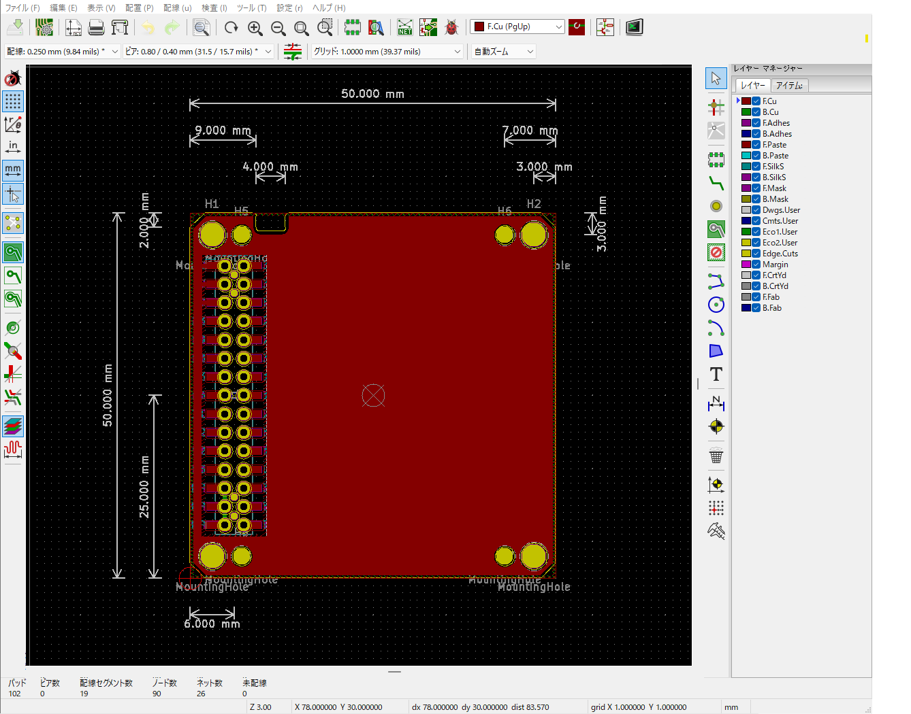

# KiCad-Template-M5Stack for KiCad7

- [Original](https://github.com/botanicfields/KiCad-Template-M5Stack)

A PCB template of modules of M5Stack with footprints for KiCad.
This is a modified version for KiCad7.

## for KiCad 6
https://github.com/botanicfields/KiCad6-Environment

## for KiCad 5
- Manufacture with a thickness of 1.0 mm.
- M-BUS pin numbers match pin headers and pin sockets in the KiCad library.
- The template has a notch, but it may be actually needed only for the M5Stack controller board.

